# AIChat: Technical Architecture Documentation

## Executive Summary

AIChat is a comprehensive LLM (Large Language Model) CLI tool written in Rust that provides a unified interface to over 20 LLM providers. The system supports multiple interaction modes (CMD, REPL, Server), RAG (Retrieval-Augmented Generation), function calling, agents, and sessions with context management.

## Technology Stack

### Core Technologies
- **Language**: Rust (Edition 2021)
- **Runtime**: Tokio (async multi-threaded)
- **HTTP Client**: Reqwest with rustls-tls
- **HTTP Server**: Hyper 1.0 with hyper-util
- **Terminal UI**: Reedline REPL with Crossterm
- **Serialization**: Serde (JSON/YAML)
- **Configuration**: YAML-based configuration files

### Key Dependencies
- **AI/ML**: Vector similarity search (HNSW), BM25 ranking, embeddings
- **Processing**: Async/await with futures-util, tokio-stream
- **Data**: IndexMap for ordered maps, parking_lot for RwLock
- **Parsing**: Fancy-regex for pattern matching, scraper for HTML
- **Security**: SHA2 for hashing, HMAC for authentication

## System Architecture

### High-Level Component Diagram

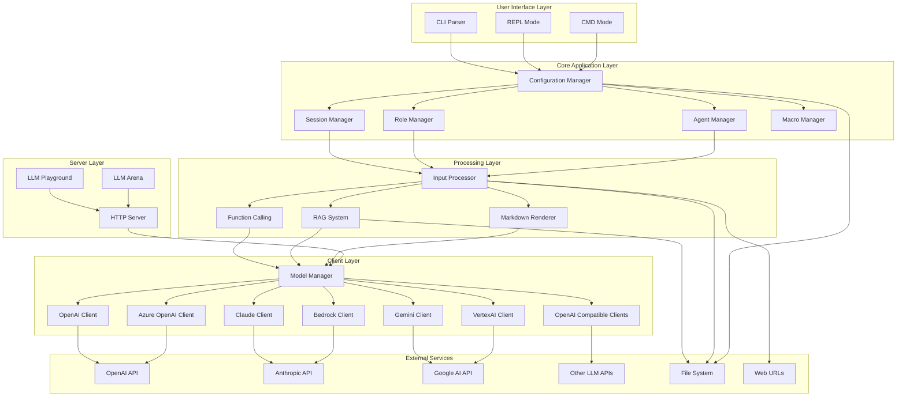

### Data Flow Architecture

```mermaid
flowchart LR
    subgraph "Input Sources"
        STDIN[Standard Input]
        FILES[Local Files]
        URLS[Remote URLs]
        CMD_ARGS[CLI Arguments]
        REPL_IN[REPL Input]
    end
    
    subgraph "Input Processing"
        PARSER[Input Parser]
        LOADER[Content Loader]
        VALIDATOR[Input Validator]
    end
    
    subgraph "Context Building"
        ROLE_CTX[Role Context]
        SESSION_CTX[Session Context]
        RAG_CTX[RAG Context]
        AGENT_CTX[Agent Context]
    end
    
    subgraph "Message Construction"
        MSG_BUILD[Message Builder]
        TOKEN_COUNT[Token Counter]
        COMPRESS[Message Compressor]
    end
    
    subgraph "LLM Interaction"
        CLIENT_SEL[Client Selector]
        REQ_BUILD[Request Builder]
        API_CALL[API Call]
        STREAM_PROC[Stream Processor]
    end
    
    subgraph "Response Processing"
        RESP_PARSE[Response Parser]
        TOOL_EXEC[Tool Execution]
        RAG_PROC[RAG Processing]
        RENDER_OUT[Output Renderer]
    end
    
    subgraph "Output Destinations"
        STDOUT[Standard Output]
        SESSION_SAVE[Session Storage]
        HISTORY[History File]
    end
    
    STDIN --> PARSER
    FILES --> LOADER
    URLS --> LOADER
    CMD_ARGS --> PARSER
    REPL_IN --> PARSER
    
    PARSER --> VALIDATOR
    LOADER --> VALIDATOR
    
    VALIDATOR --> ROLE_CTX
    VALIDATOR --> SESSION_CTX
    VALIDATOR --> RAG_CTX
    VALIDATOR --> AGENT_CTX
    
    ROLE_CTX --> MSG_BUILD
    SESSION_CTX --> MSG_BUILD
    RAG_CTX --> MSG_BUILD
    AGENT_CTX --> MSG_BUILD
    
    MSG_BUILD --> TOKEN_COUNT
    TOKEN_COUNT --> COMPRESS
    COMPRESS --> CLIENT_SEL
    
    CLIENT_SEL --> REQ_BUILD
    REQ_BUILD --> API_CALL
    API_CALL --> STREAM_PROC
    
    STREAM_PROC --> RESP_PARSE
    RESP_PARSE --> TOOL_EXEC
    RESP_PARSE --> RAG_PROC
    TOOL_EXEC --> RENDER_OUT
    RAG_PROC --> RENDER_OUT
    
    RENDER_OUT --> STDOUT
    RENDER_OUT --> SESSION_SAVE
    RENDER_OUT --> HISTORY
```

### Component Interaction Diagram

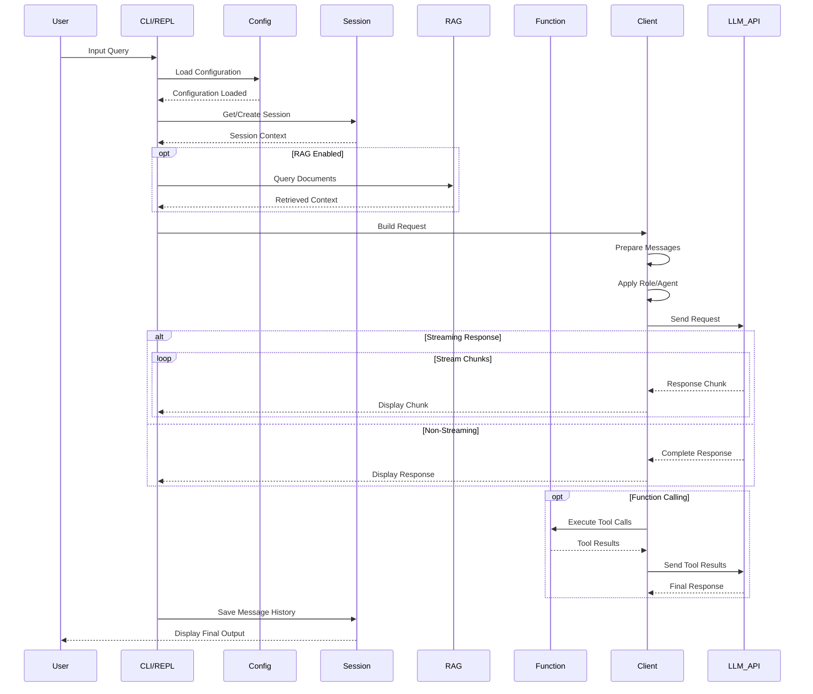

### State Management Architecture

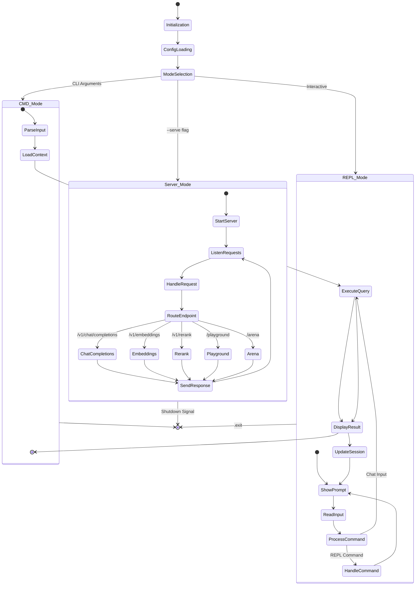

## Core Architectural Components

### 1. Configuration System

The configuration system manages application-wide settings, client configurations, and user preferences.

**Key Responsibilities:**
- Load and parse YAML configuration files
- Manage multiple LLM client configurations
- Handle environment variables and .env files
- Support dynamic configuration updates
- Manage roles, agents, macros, sessions, and RAGs

**Configuration Hierarchy:**
```
~/.config/aichat/
├── config.yaml          # Main configuration
├── .env                 # Environment variables
├── roles/               # Custom roles
├── agents/              # Agent definitions
│   └── {agent_name}/
│       ├── index.yaml   # Agent definition
│       ├── functions.json
│       └── documents/
├── sessions/            # Saved sessions
├── rags/                # RAG databases
├── macros/              # Custom macros
└── functions/           # Global functions
```

### 2. Session Management

Sessions provide context-aware conversations with message history and compression.

**Key Features:**
- Persistent conversation history
- Automatic message compression when token threshold exceeded
- Session naming and retrieval
- Token counting and management
- Message export/import

**Session Lifecycle:**
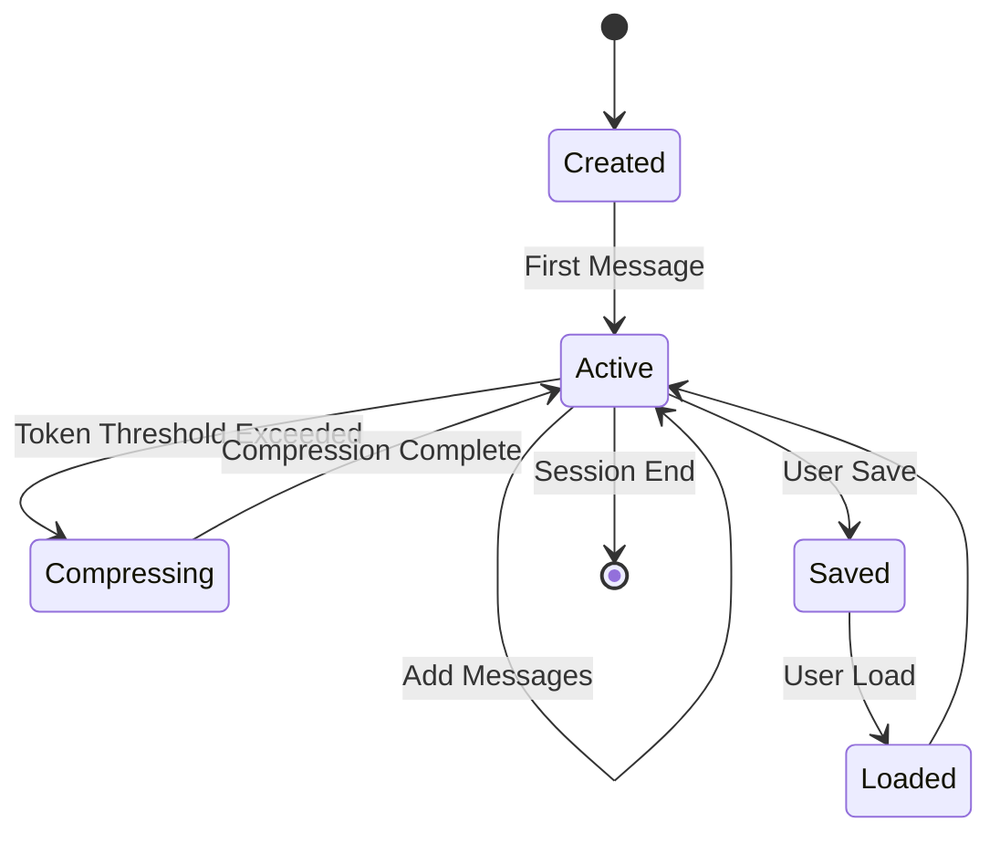

### 3. Role System

Roles define LLM behavior through prompts and model configurations.

**Built-in Roles:**
- `%shell%` - Shell command generation
- `%explain-shell%` - Shell command explanation
- `%code%` - Code generation
- `%create-title%` - Title generation

**Custom Roles:**
- User-defined prompts with metadata
- Model override per role
- Temperature and top_p settings
- Tool usage configuration

### 4. Agent System

Agents combine instructions, tools, and documents (RAG) for autonomous task execution.

**Agent Components:**
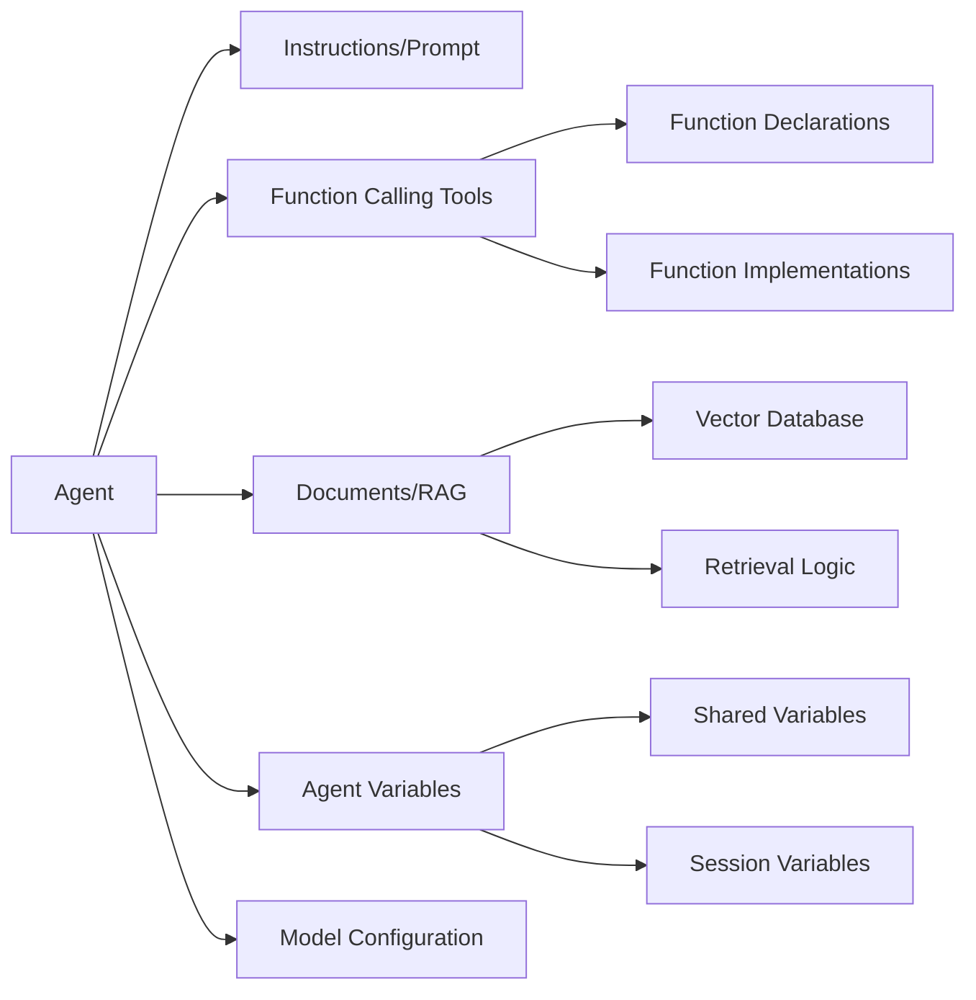

### 5. RAG (Retrieval-Augmented Generation)

RAG enables querying external documents to augment LLM responses.

**RAG Pipeline:**
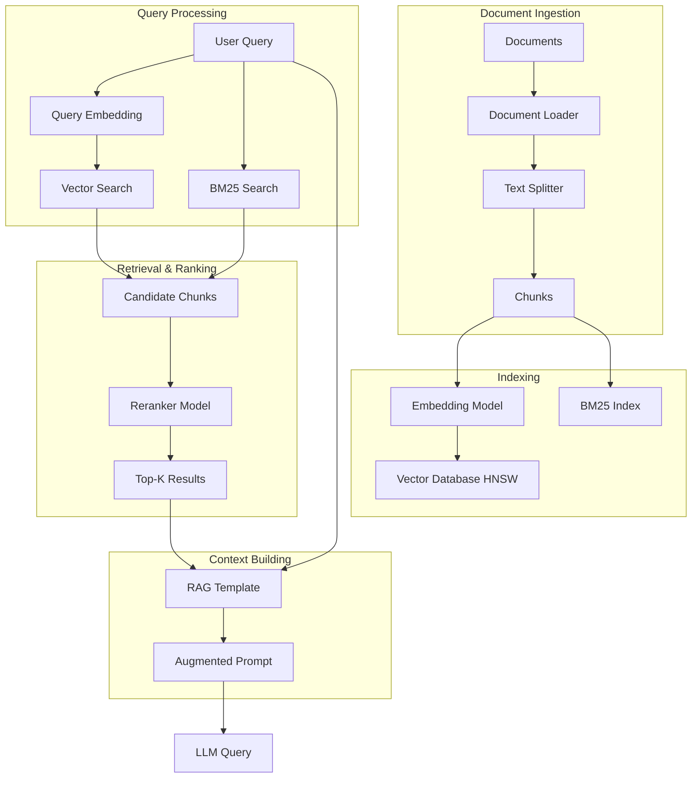

**RAG Configuration:**
- Embedding model selection
- Reranker model (optional)
- Top-K retrieval count
- Chunk size and overlap
- Custom RAG template

### 6. Function Calling

Function calling extends LLM capabilities with external tools and integrations.

**Function Call Flow:**
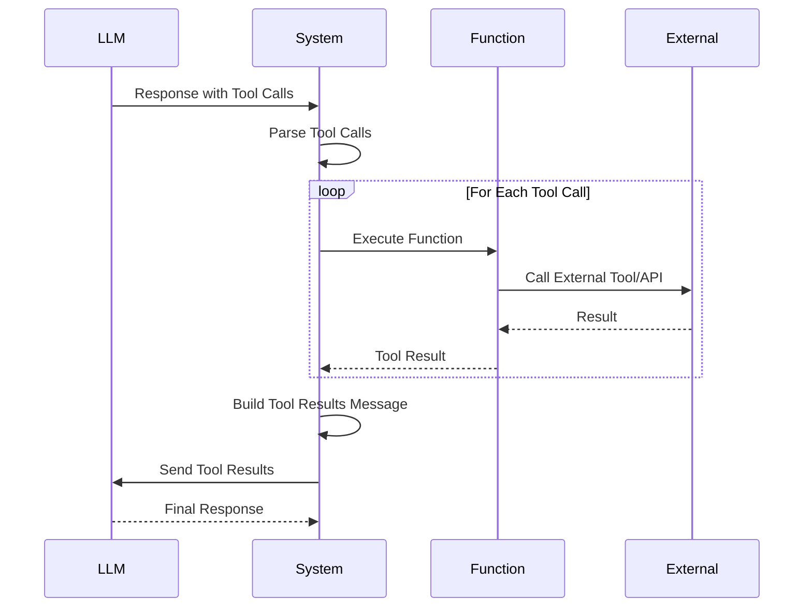

**Function Types:**
- Built-in system functions
- User-defined functions
- MCP (Model Context Protocol) integrations
- Agent-specific functions

### 7. Client Abstraction Layer

Unified interface for multiple LLM providers with provider-specific implementations.

**Supported Providers:**
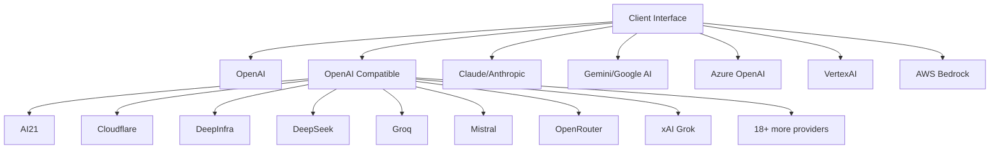

**Client Capabilities:**
- Chat completions (streaming/non-streaming)
- Embeddings
- Reranking
- Vision support
- Function calling support
- Token counting
- Rate limiting

### 8. HTTP Server

Built-in HTTP server for API proxy and web interfaces.

**Server Endpoints:**
```
GET/POST /v1/chat/completions  - OpenAI-compatible chat API
POST     /v1/embeddings        - Embeddings API
POST     /v1/rerank            - Rerank API
GET      /playground           - Interactive LLM playground
GET      /arena               - LLM comparison arena
```

**Server Features:**
- OpenAI API compatibility
- Model selection and proxying
- Streaming support (SSE)
- Web-based UIs (Playground, Arena)
- CORS support
- Graceful shutdown

## Data Model Overview

### Core Entities

1. **Config**: Global application configuration
2. **Model**: LLM model metadata and capabilities
3. **Message**: Chat message with role and content
4. **Session**: Conversation context with message history
5. **Role**: LLM behavior template with prompt
6. **Agent**: Autonomous assistant with tools and documents
7. **RAG**: Document retrieval system
8. **Function**: Callable tool definition

### Entity Relationships

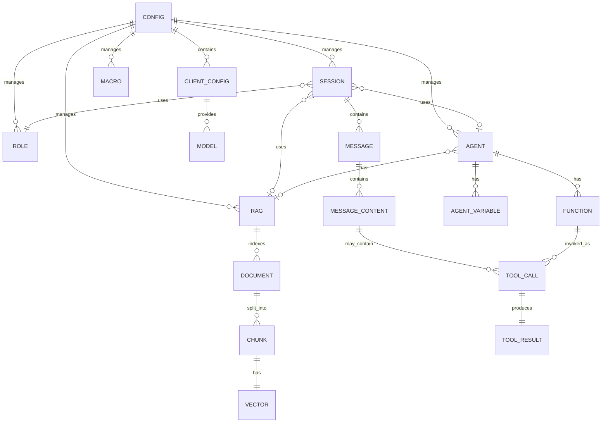

## Integration Boundaries

### External Service Integrations

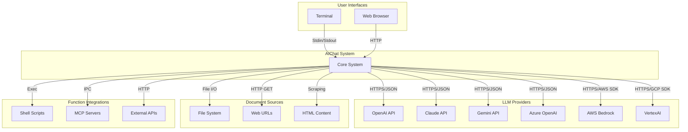

### API Contract Patterns

**Chat Completion Request:**
- Standard OpenAI format for most providers
- Provider-specific transformations
- Streaming via Server-Sent Events (SSE)
- Function calling support varies by provider

**Embedding Request:**
- Input text or array of texts
- Model selection
- Dimensions configuration (provider-specific)

**Rerank Request:**
- Query and document list
- Top-N selection
- Relevance scoring

## Security Considerations

### Authentication & Authorization
- API keys stored in configuration or environment variables
- Per-client authentication configuration
- No built-in multi-user authentication (single-user CLI)

### Data Privacy
- Local session storage
- No telemetry or external tracking
- User controls data retention

### Input Validation
- Shell command sanitization
- Path traversal protection
- URL validation
- Function call parameter validation

## Performance Characteristics

### Concurrency Model
- Tokio async runtime with multi-threaded executor
- Non-blocking I/O for HTTP requests
- Streaming responses for low latency
- Parallel document processing in RAG

### Resource Management
- Token counting for cost control
- Message compression for context window management
- Lazy loading of configurations
- Caching of embeddings and RAG indices

### Scalability
- Single-user CLI design
- Server mode supports concurrent requests
- RAG scales with document count
- Memory usage proportional to session size

## Operational Characteristics

### Configuration Management
- YAML-based configuration
- Environment variable overrides
- Hot-reload not supported (restart required)
- Migration support for config updates

### Logging & Monitoring
- Simple logger with configurable levels
- Request/response logging (debug mode)
- Error reporting to stderr
- Dry-run mode for testing

### Error Handling
- Graceful degradation
- User-friendly error messages
- Abort signal for long-running operations
- Retry logic for transient failures

## Extension Points

### Adding New LLM Providers
1. Implement client trait
2. Register in client module
3. Add configuration schema
4. Implement message transformation

### Custom Functions
1. Define function declaration (JSON)
2. Implement function handler (shell script, binary, MCP)
3. Place in functions directory
4. Configure in agent or global settings

### Document Loaders
1. Add loader for new file format
2. Implement content extraction
3. Register in document_loaders config
4. Support in RAG pipeline

### Custom Roles/Agents
1. Create role/agent definition file
2. Place in roles/agents directory
3. Configure prompts and variables
4. Optional: Add functions and documents
