# AIChat System Architecture Overview

## Executive Summary

AIChat is an all-in-one LLM (Large Language Model) CLI tool written in Rust that provides a unified interface to interact with 20+ LLM providers. The system supports multiple interaction modes (CMD, REPL, HTTP Server), RAG (Retrieval-Augmented Generation), function calling, agent workflows, and session management.

## System Architecture

### High-Level Architecture

```mermaid
graph TB
    subgraph "User Interface Layer"
        CLI[CLI Arguments]
        REPL[REPL Interactive]
        HTTP[HTTP Client]
    end
    
    subgraph "Core Application Layer"
        Main[Main Controller]
        Config[Configuration Manager]
        SessionMgr[Session Manager]
        RoleMgr[Role Manager]
        AgentMgr[Agent Manager]
    end
    
    subgraph "Business Logic Layer"
        InputProc[Input Processor]
        FuncCall[Function Calling Engine]
        RAGEngine[RAG Engine]
        Renderer[Output Renderer]
    end
    
    subgraph "Client Abstraction Layer"
        ClientFactory[Client Factory]
        ModelRegistry[Model Registry]
        StreamHandler[Stream Handler]
    end
    
    subgraph "Provider Integration Layer"
        OpenAI[OpenAI Client]
        Claude[Claude Client]
        Gemini[Gemini Client]
        Bedrock[Bedrock Client]
        VertexAI[VertexAI Client]
        Compatible[OpenAI Compatible Clients]
        Others[Other Providers...]
    end
    
    subgraph "External Services"
        LLMProviders[20+ LLM Providers]
        FuncTools[External Function Tools]
        MCPServers[MCP Servers]
    end
    
    subgraph "Storage Layer"
        FSConfig[Filesystem Config]
        Sessions[Session Storage]
        RAGData[RAG Databases]
        Functions[Function Definitions]
    end
    
    CLI --> Main
    REPL --> Main
    HTTP --> Main
    
    Main --> Config
    Main --> SessionMgr
    Main --> RoleMgr
    Main --> AgentMgr
    
    Config --> FSConfig
    SessionMgr --> Sessions
    
    Main --> InputProc
    InputProc --> FuncCall
    InputProc --> RAGEngine
    InputProc --> Renderer
    
    FuncCall --> Functions
    RAGEngine --> RAGData
    
    InputProc --> ClientFactory
    ClientFactory --> ModelRegistry
    ClientFactory --> StreamHandler
    
    ClientFactory --> OpenAI
    ClientFactory --> Claude
    ClientFactory --> Gemini
    ClientFactory --> Bedrock
    ClientFactory --> VertexAI
    ClientFactory --> Compatible
    ClientFactory --> Others
    
    OpenAI --> LLMProviders
    Claude --> LLMProviders
    Gemini --> LLMProviders
    Bedrock --> LLMProviders
    VertexAI --> LLMProviders
    Compatible --> LLMProviders
    Others --> LLMProviders
    
    FuncCall --> FuncTools
    FuncCall --> MCPServers
```

## Component Architecture

### 1. Entry Points and Working Modes

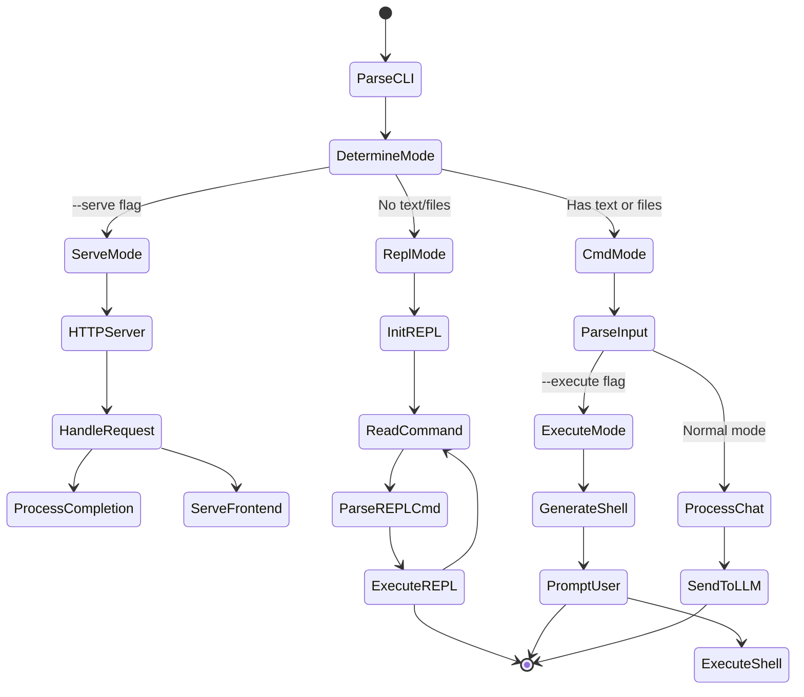

### 2. Configuration System

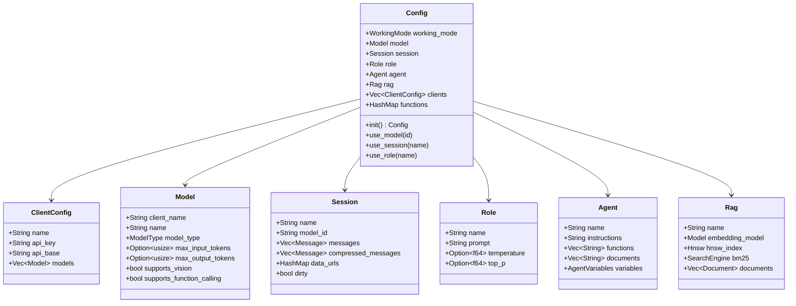

### 3. Message Flow and Processing

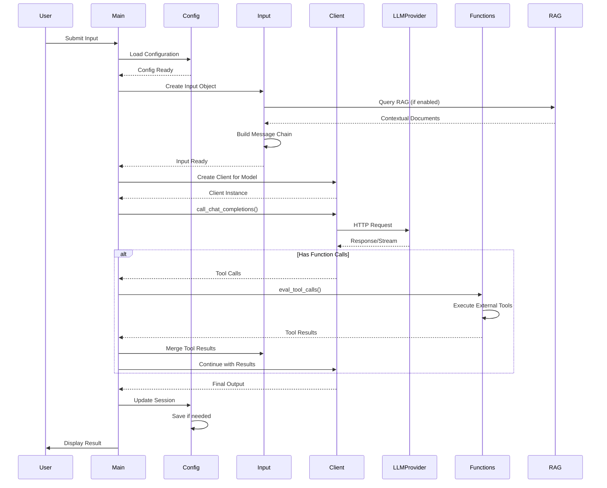

### 4. Client Architecture

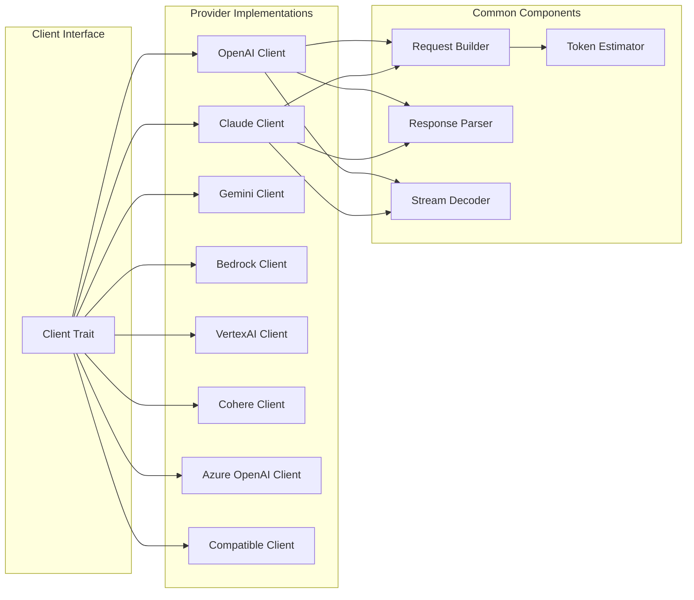

### 5. RAG System Architecture

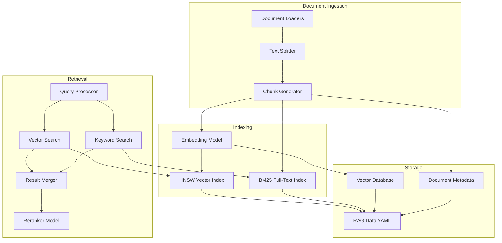

### 6. Function Calling System

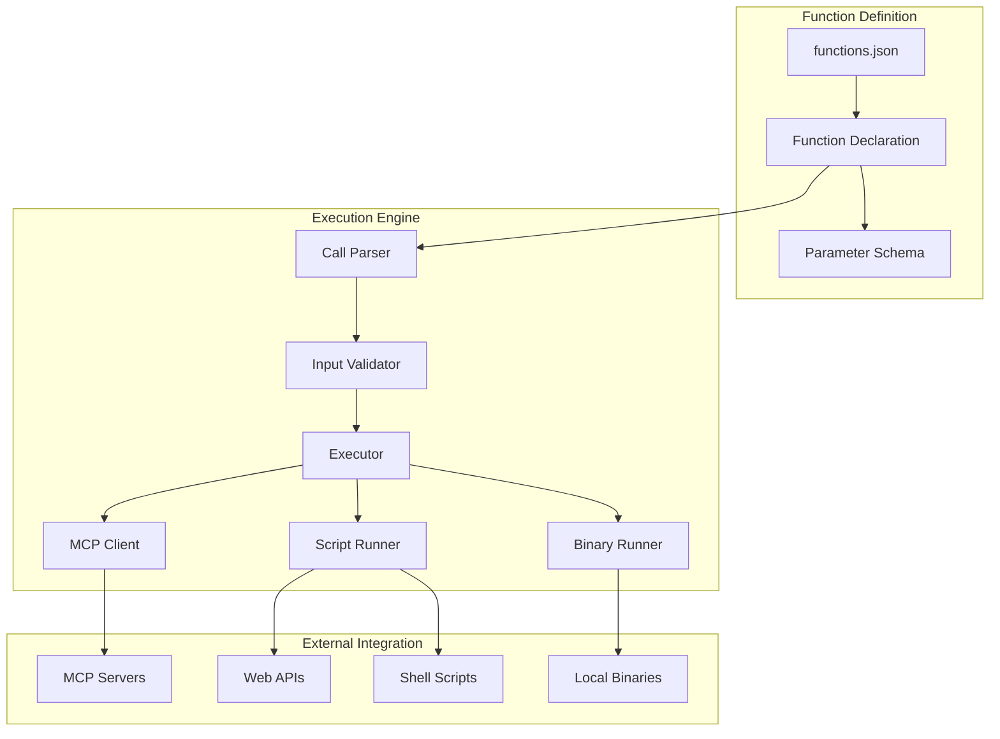

### 7. HTTP Server Architecture (Serve Mode)

```mermaid
graph TB
    subgraph "HTTP Server"
        Listener[TCP Listener]
        Router[Route Handler]
        Middleware[Middleware]
    end
    
    subgraph "API Endpoints"
        ChatAPI[/v1/chat/completions]
        EmbedAPI[/v1/embeddings]
        RerankAPI[/v1/rerank]
    end
    
    subgraph "Web Frontends"
        Playground[/playground]
        Arena[/arena]
        Static[Static Assets]
    end
    
    subgraph "Processing"
        RequestValidator[Request Validator]
        ModelSelector[Model Selector]
        StreamProcessor[Stream Processor]
        ResponseBuilder[Response Builder]
    end
    
    Listener --> Router
    Router --> Middleware
    
    Middleware --> ChatAPI
    Middleware --> EmbedAPI
    Middleware --> RerankAPI
    Middleware --> Playground
    Middleware --> Arena
    Middleware --> Static
    
    ChatAPI --> RequestValidator
    EmbedAPI --> RequestValidator
    RerankAPI --> RequestValidator
    
    RequestValidator --> ModelSelector
    ModelSelector --> StreamProcessor
    StreamProcessor --> ResponseBuilder
```

## Data Flow Diagrams

### 1. Chat Completion Flow (Non-Streaming)

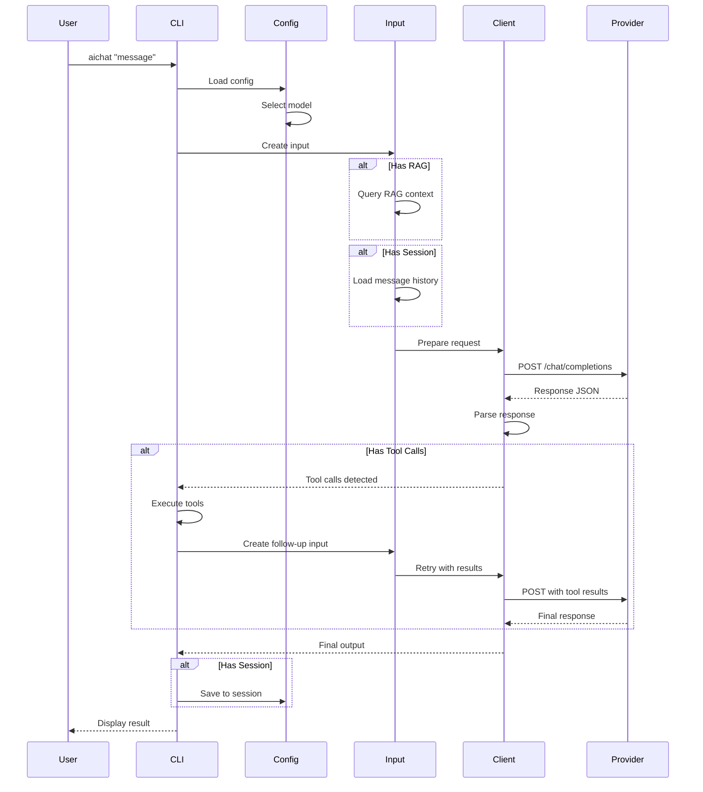

### 2. Chat Completion Flow (Streaming)

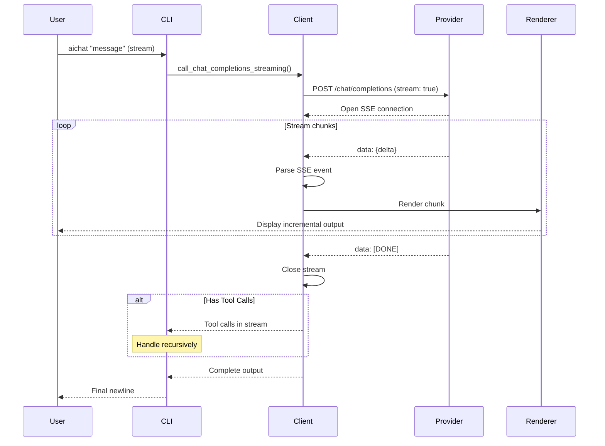

### 3. REPL Command Processing

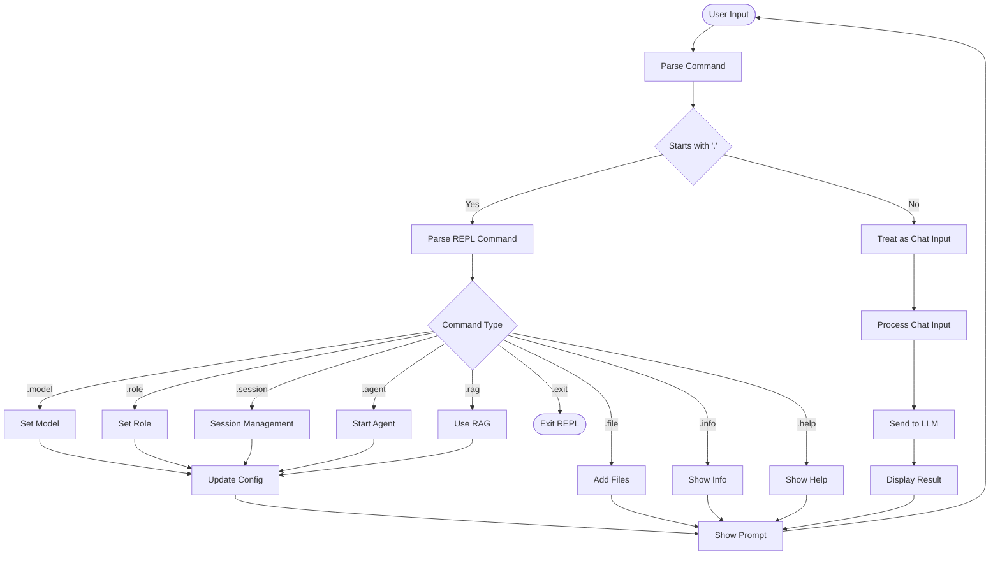

### 4. Agent Workflow Execution

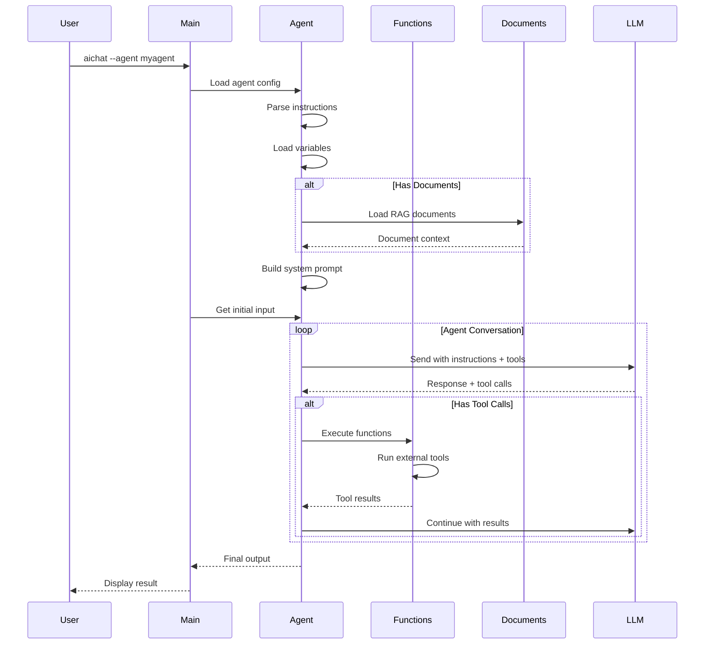

## Integration Boundaries

### External LLM Provider Integration

```mermaid
graph LR
    subgraph "AIChat"
        ClientImpl[Client Implementation]
        Auth[Authentication]
        RateLimit[Rate Limiter]
        Retry[Retry Logic]
    end
    
    subgraph "HTTP Layer"
        TLS[TLS Connection]
        Headers[HTTP Headers]
        Body[Request Body]
    end
    
    subgraph "Provider API"
        Endpoint[API Endpoint]
        Validation[Request Validation]
        Processing[LLM Processing]
        Response[Response Generation]
    end
    
    ClientImpl --> Auth
    Auth --> RateLimit
    RateLimit --> Retry
    
    Retry --> TLS
    TLS --> Headers
    Headers --> Body
    
    Body --> Endpoint
    Endpoint --> Validation
    Validation --> Processing
    Processing --> Response
    
    Response --> Body
```

### Function Calling Integration (MCP)

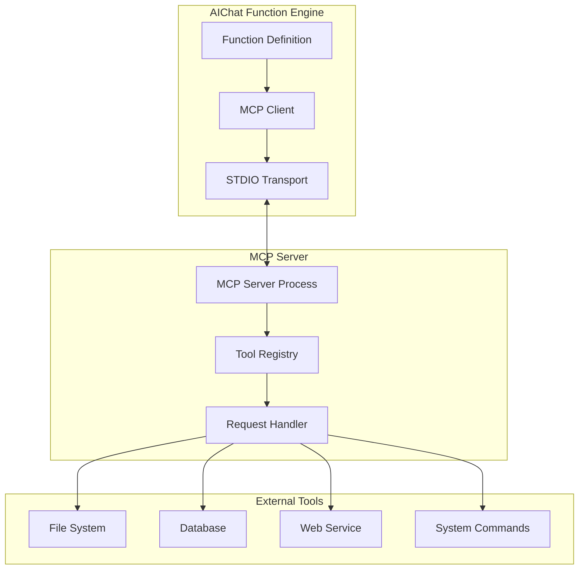

## Technology Stack Summary

### Core Technologies
- **Language**: Rust 2021 Edition
- **Async Runtime**: Tokio (multi-threaded)
- **HTTP Client**: Reqwest (with TLS)
- **HTTP Server**: Hyper + Hyper-util
- **CLI Parsing**: Clap (derive API)
- **REPL**: Reedline + Crossterm

### Data & Serialization
- **Configuration**: YAML (serde_yaml)
- **JSON**: serde_json (with preserve_order)
- **Binary**: bincode
- **Serialization**: serde

### AI/ML Components
- **Vector Search**: hnsw_rs (HNSW algorithm)
- **Full-Text Search**: bm25
- **Embeddings**: Provider APIs
- **Reranking**: Provider APIs

### Concurrency & Synchronization
- **Locks**: parking_lot (RwLock, Mutex)
- **Async Streams**: tokio-stream
- **Graceful Shutdown**: tokio-graceful
- **Channels**: tokio::sync::mpsc

### Utilities
- **Markdown Rendering**: Custom renderer with syntect
- **Syntax Highlighting**: syntect
- **Shell Integration**: shell-words, duct
- **Clipboard**: arboard (platform-specific)
- **HTML Parsing**: scraper, html_to_markdown

## Storage Architecture

### Filesystem Layout

```
~/.config/aichat/
├── config.yaml              # Main configuration
├── .env                     # Environment variables
├── roles/                   # Role definitions
│   ├── role1.md
│   └── role2.yaml
├── sessions/                # Session history
│   ├── session1.yaml
│   └── session2.yaml
├── rags/                    # RAG databases
│   ├── rag1.yaml
│   └── rag2.yaml
├── functions/               # Function definitions
│   ├── functions.json
│   └── bin/                 # Function binaries
├── agents/                  # Agent configurations
│   ├── agent1.yaml
│   └── agent2.yaml
└── macros/                  # Macro definitions
    ├── macro1.sh
    └── macro2.sh
```

### Configuration Data Model

```yaml
# config.yaml
model: openai:gpt-4
temperature: 0.7
top_p: 0.95
save_session: false
stream: true

clients:
  - type: openai
    api_key: sk-...
    models:
      - name: gpt-4
        max_input_tokens: 128000
        max_output_tokens: 4096
        supports_vision: true
        supports_function_calling: true

  - type: claude
    api_key: sk-ant-...
    models:
      - name: claude-3-opus-20240229
        max_input_tokens: 200000
        max_output_tokens: 4096

rag_embedding_model: openai:text-embedding-3-small
rag_reranker_model: cohere:rerank-english-v3.0
rag_top_k: 5
```

### Session Data Model

```yaml
# sessions/example.yaml
model: openai:gpt-4
temperature: 0.7
role_name: assistant
messages:
  - role: system
    content: "You are a helpful assistant."
  - role: user
    content: "Hello, how are you?"
  - role: assistant
    content: "I'm doing well, thank you!"
compressed_messages: []
data_urls: {}
```

### RAG Data Model

```yaml
# rags/codebase.yaml
embedding_model: openai:text-embedding-3-small
chunk_size: 1000
chunk_overlap: 200
reranker_model: cohere:rerank-english-v3.0
top_k: 5
document_paths:
  - "/path/to/docs"
  - "/path/to/code"
documents:
  - id: 0
    path: "/path/to/file.md"
    hash: "abc123..."
    chunks:
      - id: 0
        text: "Document content..."
        start_char: 0
        end_char: 1000
vectors:
  - [0.1, 0.2, 0.3, ...]  # Embeddings
```

## Security Considerations

1. **API Key Management**: 
   - Keys stored in config files with restricted permissions
   - Support for environment variables
   - Never logged or displayed

2. **Network Security**:
   - TLS for all external communications
   - Certificate validation enabled
   - Support for SOCKS proxies

3. **Input Validation**:
   - File path validation and sanitization
   - Command injection prevention in shell execution
   - JSON schema validation for API requests

4. **Function Execution**:
   - Sandboxed execution of external tools
   - Whitelisted function definitions
   - User confirmation for dangerous operations

## Performance Characteristics

1. **Streaming**: Real-time output for better UX
2. **Async I/O**: Non-blocking operations for file and network I/O
3. **Parallel Processing**: RAG document processing uses rayon
4. **Caching**: Model metadata cached in memory
5. **Efficient Search**: HNSW for vector search, BM25 for full-text

## Scalability & Limitations

1. **Single Process**: Designed as single-user CLI tool
2. **Local Storage**: All data stored on local filesystem
3. **Memory**: Session history and RAG indices loaded in memory
4. **Concurrency**: HTTP server handles multiple concurrent requests
5. **Token Limits**: Respects provider token limits, with compression support
